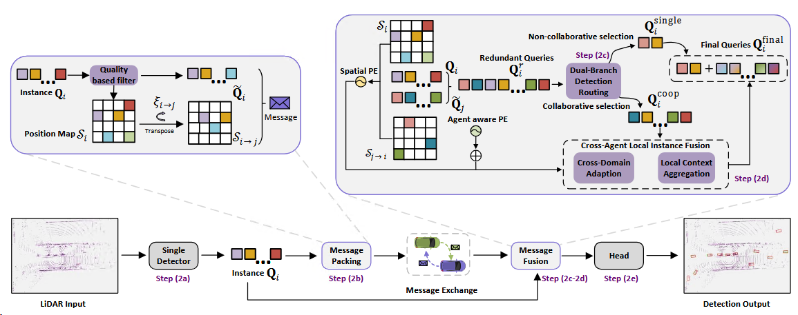

# INSTINCT (ICCV 2025)

INSTINCT: Instance-Level Interaction Architecture for Query-Based Collaborative Perception 



## Abstract
Collaborative perception systems overcome single-vehicle limitations in long-range detection and occlusion scenarios by integrating multi-agent sensory data, improving accuracy and safety. However, frequent cooperative interactions and real-time requirements impose stringent bandwidth constraints. Previous works proves that query-based instance-level interaction reduces bandwidth demands and manual priors, however, LiDAR-focused implementations in collaborative perception remain underdeveloped, with performance still trailing state-of-the-art approaches. To bridge this gap, we propose INSTINCT (instance-level interaction architecture), a novel collaborative perception framework featuring three core components:  1. a quality-aware filtering mechanism for high-quality instance feature selection;  2. a dual-branch detection routing scheme to decouple collaboration-irrelevant and collaboration-relevant instances;  3. a Cross Agent Local Instance Fusion module to aggregate local hybrid instance features.  Additionally, we enhance the ground truth (GT) sampling technique to facilitate training with diverse hybrid instance features. Extensive experiments across multiple datasets demonstrate that INSTINCT achieves superior performance. Specifically, our method achieves an improvement in accuracy 13.23%/32.24% in DAIR-V2X and V2V4Real while reducing the communication bandwidth to 1/281 and 1/264 compared to state-of-the-art methods. The code will be released soon.

## Installation

You can refer to the CoAlign Installation Guide [Chinese Ver.](https://udtkdfu8mk.feishu.cn/docx/LlMpdu3pNoCS94xxhjMcOWIynie) or [English Ver.](https://udtkdfu8mk.feishu.cn/docx/SZNVd0S7UoD6mVxUM6Wc8If6ncc) to learn how to install this repo. 


## Data Preparation

The data preparation is also the same as that of CoAlign and [OpenCOOD](https://opencood.readthedocs.io/en/latest/md_files/data_intro.html). For the DAIR-V2X dataset, please use the [supplemented annotations](https://siheng-chen.github.io/dataset/dair-v2x-c-complemented/).


## Quick Start

### Train your CoEPFT.
To quickly train your own INSTINCT, please run the following commond:
```
python opencood/tools/train_simple.py -y dairv2x opencood/lidar_only_with_noise/second_CQCPInstance_onecycle.yaml
```

### Test the model
Suppose your trained INSTINCT is saved in `#your_INSTINCT_path`, and then run this command:

```
python opencood/tools/inference_simple.py --model_dir #your_INSTINCT_path
```

## Checkpoints

The main checkpoints can be downloaded [coming soon](https://drive.google.com), and then save them in the `opencood/logs` directory. Note that our checkpoints rely on `spconv=2.3.6`.

## Citation


## Acknowledgements

Thank for the excellent collaborative perception codebases [OpenCOOD](https://github.com/DerrickXuNu/OpenCOOD) , [CoAlign](https://github.com/yifanlu0227/CoAlign) and [ConQueR](https://github.com/V2AI/EFG).

